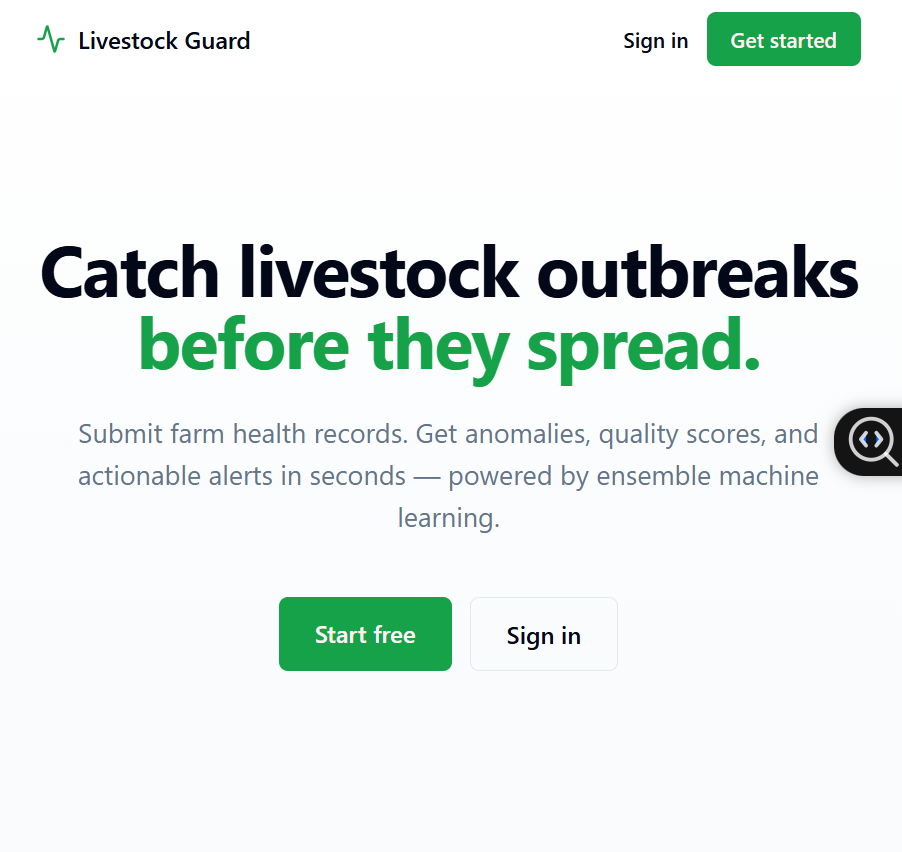
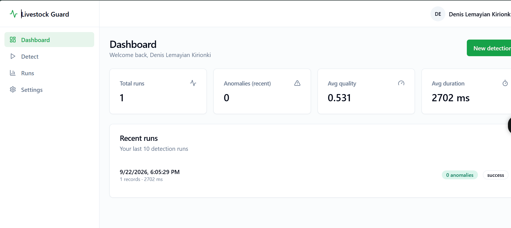
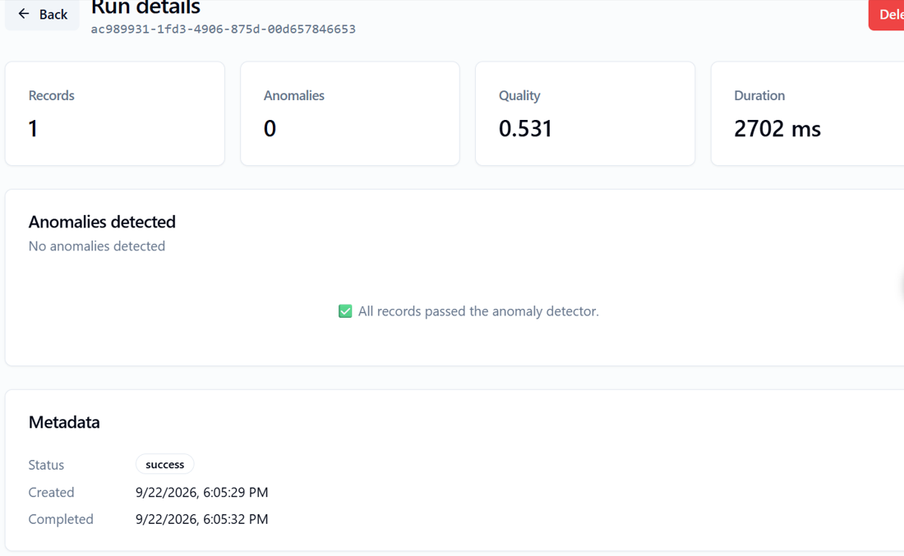

# Livestock Outbreak Detection

> End-to-end platform that detects livestock disease outbreaks before they spread.

A full-stack application that ingests farm health records, validates them against a schema, runs ensemble anomaly detection, and surfaces results via a web dashboard, email alerts, and a REST API.

---

## Live demo

- **Frontend:** [app.lemayian.com](https://app.lemayian.com)
- **API docs:** [api.lemayian.com/docs](https://api.lemayian.com/docs)
- **API health:** [api.lemayian.com/health](https://api.lemayian.com/health)

---

## Screenshots

| Landing | Detect | Run detail |
|---------|--------|-----------|
|  |  |  |

---

## Features

- **Multi-user auth** — signup, login, JWT access tokens, httpOnly refresh cookies
- **Ensemble anomaly detection** — Isolation Forest, statistical Z-scores, seasonal decomposition
- **Schema validation** — Pydantic-enforced records with business rules (sick ≤ total, etc.)
- **Data quality scoring** — completeness, accuracy, consistency, timeliness → grade A–F
- **Persistent run history** — every detection stored, filterable, downloadable
- **API keys** — issue/revoke keys for programmatic access
- **Structured logging** — JSON logs with rotation, context, and performance timing
- **Health monitoring** — pre-flight checks, system metrics, service reachability
- **Feature toggles** — enable/disable modules per environment

---

## Architecture

```
┌──────────────────────────────────────────────────────────────┐
│                       End User (Browser)                     │
└──────────────────────────────┬───────────────────────────────┘
                               │
                               │ HTTPS + JWT
                               ▼
┌──────────────────────────────────────────────────────────────┐
│                  Frontend — Next.js 15                       │
│                  https://app.lemayian.com                    │
│                  Hosted on: NovaHost cPanel (Node.js 20)     │
└──────────────────────────────┬───────────────────────────────┘
                               │
                               │ REST API (Bearer JWT)
                               ▼
┌──────────────────────────────────────────────────────────────┐
│                  Backend — FastAPI (Python 3.11)             │
│                  https://api.lemayian.com                    │
│                  Hosted on: Render                           │
│                                                              │
│   /auth/*    /v1/detect    /v1/validate                      │
│   /runs/*    /api-keys/*   /health                           │
└──────────────────────────────┬───────────────────────────────┘
                               │
                               │ SQLAlchemy / psycopg3
                               ▼
┌──────────────────────────────────────────────────────────────┐
│                  Database — PostgreSQL                       │
│                  Hosted on: Neon (free tier)                 │
│                                                              │
│   users    runs    anomalies    api_keys                     │
└──────────────────────────────────────────────────────────────┘
```

**Backend** (`src/`)
- `api/` — FastAPI app, auth, SQLAlchemy models, routers
- `anomaly_detection/` — Isolation Forest, statistical, seasonal, ensemble
- `data_validation/` — schema enforcement + business rules
- `data_quality/` — completeness, accuracy, consistency, timeliness
- `config_manager/` — multi-env config, encrypted secrets
- `custom_logging/` — structured JSON logs with rotation
- `monitoring/` — health checks, system metrics
- `reporting/` — HTML report generation

**Frontend** (`frontend/`)
- Next.js 15 (App Router) + TypeScript
- Tailwind CSS + shadcn/ui
- Bearer JWT + httpOnly refresh cookie
- Recharts for visualizations
---

## Tech stack

| Layer | Technology |
|---|---|
| Frontend | Next.js 15, React 19, Tailwind, shadcn/ui, Recharts |
| Backend | FastAPI, SQLAlchemy 2.0, Alembic, Pydantic v2 |
| Database | PostgreSQL (Neon) |
| Auth | JWT (HS256), bcrypt, httpOnly refresh cookies |
| Frontend hosting | NovaHost cPanel (Node.js 20, Passenger) |
| Backend hosting | Render |
| CI | GitHub Actions |
| Monitoring | Structured logs, health endpoints |

---

## Quickstart

### Backend

```bash
git clone https://github.com/lemayian23/livestock_outbreak_detection.git
cd livestock_outbreak_detection

python -m venv venv
venv\Scripts\activate      # Windows
# source venv/bin/activate # macOS/Linux

pip install -r requirements.txt

cp .env.example .env
# Edit .env with your DATABASE_URL and AUTH_SECRET_KEY

alembic upgrade head
python api_main.py

API runs at http://localhost:8000. Swagger UI at /docs.

Frontend
bash
cd frontend
npm install
cp .env.local.example .env.local
npm run dev
App runs at http://localhost:3000.

Environment variables
Backend (.env)
text
DATABASE_URL=postgresql+psycopg://...
AUTH_SECRET_KEY=<random-64-chars>
ACCESS_TOKEN_EXPIRE_MINUTES=15
REFRESH_TOKEN_EXPIRE_DAYS=7
API_KEY=<random-64-chars>
APP_ENV=development
Generate secrets:

bash
python -c "import secrets; print(secrets.token_urlsafe(48))"
Frontend (frontend/.env.local for dev, .env.production for prod)
text
NEXT_PUBLIC_API_BASE_URL=http://localhost:8000
For production:

text
NEXT_PUBLIC_API_BASE_URL=https://api.lemayian.com
API surface
Endpoint	Method	Auth	Description
/health	GET	public	Liveness check
/auth/signup	POST	public	Create account
/auth/login	POST	public	Log in
/auth/refresh	POST	cookie	Rotate access token
/auth/me	GET	JWT	Current user
/v1/detect	POST	JWT or API key or public	Run detection
/v1/detect/csv	POST	any	Detection on CSV upload
/v1/validate	POST	any	Schema validation only
/v1/features	GET	any	List feature toggles
/runs	GET	JWT	List user's runs
/runs/{id}	GET	JWT	Run detail
/runs/{id}	DELETE	JWT	Delete run
/api-keys	GET/POST	JWT	Manage API keys
/api-keys/{id}	DELETE	JWT	Revoke key
Full OpenAPI spec at /openapi.json.

Testing
bash
pytest tests/ -v          # 96 tests
Frontend build check:

bash
cd frontend
npm run build
Deployment
See DEPLOYMENT.md for full production deployment instructions
(NovaHost cPanel Node.js + Render + Neon).

## License

MIT — see [LICENSE](LICENSE).
